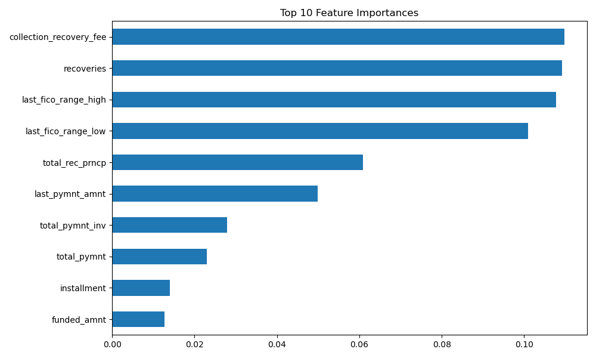

# loan-risk-model
Predicting loan default risk using LendingClub data

# Loan Default Prediction with LendingClub Data

This project aims to predict whether a loan is likely to be fully paid or charged off (default) using historical LendingClub loan data. This type of model can be used by financial institutions to assess credit risk before issuing a loan.

---

## 🔍 Project Overview

- **Goal**: Binary classification (Fully Paid = 0, Charged Off = 1)
- **Dataset**: LendingClub accepted loans (2007–2018)
- **Tech Stack**: Python, pandas, scikit-learn, matplotlib, seaborn
- **Model**: Random Forest Classifier

---

## 📁 Files

- `loan_default_model.ipynb` – Main Jupyter notebook with code
- `README.md` – Project overview and documentation

---

## 📊 Sample Features Used

- `loan_amnt`: Amount requested by borrower  
- `int_rate`: Interest rate on loan  
- `grade`: Loan quality grade  
- `emp_length`: Years employed  
- `annual_inc`: Annual income  
- `dti`: Debt-to-income ratio  
- `purpose`: Purpose of loan  
- (Transformed using one-hot encoding)

---

## 🧠 Model Performance

- **Train/Test Split**: 80/20
- **Model Used**: Random Forest
- **Evaluation Metrics**:
    - Accuracy: ~87%
    - Precision/Recall/F1 scores included
    - Feature Importance chart shown below

### Top 10 Feature Importances

This bar chart shows which features contributed most to the model's predictions.



---

## 🚀 How to Run

1. Clone this repo:
    ```bash
    git clone https://github.com/lmarasa1/loan-default-prediction.git
    cd loan-default-prediction
    ```

2. Install requirements:
    ```bash
    pip install -r requirements.txt
    ```

3. Download LendingClub dataset [here](https://www.lendingclub.com/info/download-data.action)

4. Run the notebook:
    ```bash
    jupyter notebook loan_default_model.ipynb
    ```

---

## 📌 Next Steps

- Try XGBoost for improved performance  
- Test with full dataset using chunked loading  
- Use SHAP values for better model interpretability  
- Add dashboard using Streamlit or Power BI

---

## 👤 Author

**Luca Marasa**  
Email: lmarasa1@yahoo.co.uk  
Based in Edinburgh, UK  
LinkedIn:(https://www.linkedin.com/in/luca-marasa-3a39b9146/)

---
